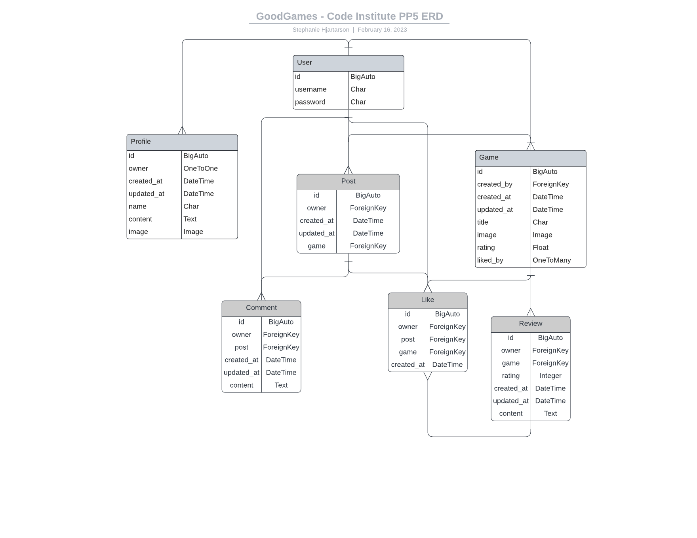

# GoodGames
Welcome to the DRF API for GoodGames! 

GoodGames is a website where you can share the video games you're currently playing, and leave a review for each game. You can leave comments on other users' posts. You can like other users' posts, comments, reviews, and games, and customise your own profile image and description.

This is the backend API database, built with Django REST Framework.

- The deployed version of the API is [HERE](https://goodgames-drf-api.herokuapp.com/).
- The deployed version of the full site built in React is [HERE](https://goodgames-react.herokuapp.com/).
- The frontend repository is [HERE](https://github.com/StephHjar/goodgames-react).

## Entity Relationship Diagram
In the planning stage of this project, I created this Entity Relationship Diagram (ERD) to better visualize the relationships between models in the database.


## User Stories
I have divided the functionality of the site and database into epics and user stories. These can be found on the [project board](https://github.com/users/StephHjar/projects/6/views/1) of my frontend app, and documented below:

### **Epic:** Account Management

**User Stories:**
- As a **user** I can **sign up for an account** so that I can **make and like posts, and add games**
- As a **user** I can **log in and out of my account** so that I can **access the site from different devices and keep my account secure**
- As a **user** I can **add a profile photo and description** so that **I can personalise my profile**
- As a **user** I can **request to reset my password via email** so that **I can log back in to my account if I forget my login details**
- As a **user** I can **delete my profile** so that **my personal details are not saved if I don't want to use the site anymore**

### **Epic:** Managing Posts

**User Stories:**
- As a **user** I can **add a new post** so that **I can show when I start playing a game** 
- As a **user** I can **edit my posts** so that **I can make updates, or mark when I have finished playing the game**
- As a **user** I can **delete my posts** so that **I can remove posts made in error, or that I don't want displayed on my profile anymore**
- As a **user** I can **like and unlike other users' posts** so that **I can engage with content that I enjoy**

### **Epic:** Managing Comments

**User Stories:**
- As a **user** I can **comment on other users' posts** so that **I can engage in conversations with other users**
- As a **user** I can **edit comments I have made** so that **I can correct mistakes in my comments**
- As a **user** I can **delete comments I have made** so that **I can remove comments posted by mistake**

### **Epic:** Managing Games

**User Stories:**
- As a **user** I can **request to add a new game to the site's database** so that **I can leave reviews and share the game on my profile**
- As a **user** I can **request edits to an existing game** so that **the information on the site is correct**
- As a **user** I can **add a review to a game** so that **I can share my thoughts on the game with other users**
- As a **user** I can **edit or delete my own reviews** so that **I can fix errors or change my review if my opinions change**
- As a **user** I can **like other users' reviews** so that **I can engage with other reviews I agree with**

### **Epic:** Admin Capabilities

**User Stories:**
- As a **site admin** I can **add, edit, and delete games from the database** so that **users have the most up-to-date list of games to choose from**
- As a **site admin** I can **remove posts or comments if they are not appropriate or relevant** so that **the site is enjoyable and accessible to all users**
- As a **site admin** I can **see lists of all user profiles, posts, games, reviews, likes, and comments** so that **I have an overview of all activity on the site**

## Testing 
Manual and validator testing is documented in my [Testing file](TESTING.md).

## Deployment

### Local Deployment
​
*Gitpod* IDE was used to write the code for this project.

To preview the project in the development environment, run the following command in the terminal:
```python3 manage.py runterminal```. This will open port 8000. Click *Open Browser* when the popup window appears.

To make a local copy of this repository, you can clone the project by typing the follow into your IDE terminal:
- `git clone https://github.com/StephHjar/goodgames-drf-api.git` 

Alternatively, if using Gitpod, you can click below to create your own workspace using this repository.

[](https://gitpod.io/#https://github.com/StephHjar/goodgames-drf-api)

### Preparing File for Deployment
If you have not already set up Postgres for use in the deployed application, complete the following steps:

- In the terminal, type `pip3 install psycopg2-binary` and press enter.
- Install gunicorn, which will act as the web server. Type `pip3 install gunicorn` in the terminal and press enter.
- You can install this project's requirements (where applicable) using: `pip3 install -r requirements.txt`. If you have your own packages that have been installed, which I did, then the requirements file needs to be updated using: `pip3 freeze --local > requirements.txt`:
  - In the terminal, type `pip3 freeze --local > requirements.txt`. This will create or update a file called `requirements.txt`, with a list of all the packages that Heroku will need to install to run our app.
- Create a Procfile in the root folder of your project, and add the following to the Procfile: `web: gunicorn <app_name>.wsgi:application`.

### ElephantSQL Deployment

To host my database, I used ElephantSQL. 

The instructions to create a new account can be[found here](https://code-institute-students.github.io/deployment-docs/02-elephantsql/elephantsql-01-sign-up), provided by Code Institute. 

Once you have created an account:
- Log in to ElephantSQL to access your dashboard.
- Click *Create New Instance*.
- Give your plan a name (usually the name of the project, in this case *GoodGames-DRF-API*).
- Select the Tiny Turtle (Free) plan.
- Leave the Tags field blank.
- Click *Select Region* and choose a data center near you.
- Click *Review*, then, if everything looks correct, *Create Instance*.
- Go back to your dashboard and click on the name of the project. 
- Copy the database URL for your project, and use it in two places:
  - In your `env.py` file, create a new key called `DATABASE_URL` and give it the value of the ElephantSQL database URL, as follows: ` os.environ.setdefault("DATABASE_URL", "my_copied_database_url")`.
    - Before deploying the project, create a file called `env.py` (if it hasn't been created already), and complete the following steps:
      - In `settings.py`: At the top of the file, add the following import:
      ```python
      import os

      if os.path.isfile("env.py"):
          import env
      ```
      - Replace the pasted-in database url with the following code:
      ```python
      os.environ.get("DATABASE_URL")
      ```
  - Paste the database URL into the config vars section of your project on Heroku - instructions are in the *Heroku Deployment* section below. 

After the above steps are completed, install dj-database-url to your project, by typing the following command in the terminal and pressing enter:
- `os.environ.setdefault("DATABASE_URL", "my_copied_database_url")`
- Then update `requirements.txt` by typing `pip3 freeze --local > requirements.txt`.

### Heroku Deployment
​
This project uses [Heroku](https://www.heroku.com), a platform as a service (PaaS) that enables developers to build, run, and operate applications entirely in the cloud.

To set up an account:

- Go to [heroku.com](https://www.heroku.com) to register for a free account.
- For my account, I set my *Role* as *Hobbyist* and *Primary development language* as Python.
- Click *Create free account*.

I used the [Code Institute Gitpod Full Template](https://github.com/Code-Institute-Org/gitpod-full-template) for this project, which means the Heroku command line interface (CLI) came pre-installed. Please check the [Heroku documentation](https://devcenter.heroku.com/articles/heroku-cli) for the most up-to-date installation instructions. 

To log in to the Heroku CLI:

- In the terminal, type ```heroku login -i``` and press enter.. 
- Enter your username and password in the terminal.
- If you have Multi-Factor Authentication turned on:
  - Click on Account Settings (via the avatar menu) on the Heroku Dashboard.
  - Scroll down to the API Key section and click Reveal. Copy the key.
  - Use the login command: heroku login -i
  - Enter your Heroku username.
  - Enter the API key you just copied when prompted for your password.

Deployment steps are as follows, from the Heroku dashboard:
​
- Select *New* in the top-right corner of your Heroku Dashboard, and select *Create new app* from the dropdown menu.
- Enter a name for your app. The app name must be unique, so you need to adjust the name until you find a name that hasn't been used.
- From the dropdown, choose the region closest to you (EU or USA), and finally, select *Create App*.
- From the new app *Settings*, click *Reveal Config Vars*, and add a new Config Var with the KEY set to `DATABASE_URL` and the value to the ElephantSQL database URL you copied above.
- I added additional Config Vars for the folLowing:
  - `ALLOWED_HOST` with the url for my deployed API (*goodgames-drf-api.herokuapp.com*).
  - `CLIENT_ORIGIN` with the url for my deployed frontend application (*https://goodgames-react.herokuapp.com*).
  - `CLIENT_ORIGIN_DEV` with the url for the development version of my frontend application (*https://3000-stephhjar-goodgamesreac-2fkbldq92dd.ws-eu89.gitpod.io*)
  - `CLOUDINARY_URL` copied from my [Cloudinary](https://cloudinary.com/) dashboard, because I used Cloudinary to host my static files.
  - `DISABLE_COLLECTSTATIC` to *1* because I do not need to load new static files on deployment.
  - `SECRET_KEY` which contains my secret key (also included in `env.py`).

For Heroku deployment, follow these steps to connect your GitHub repository to the newly created app:
​
- At the top of the screen on Heroku, select *Deploy*.
- Next to *Deployment method* select *GitHub*, then scroll down and click *Connect to GitHub* to confirm you want to connect.
- In the *repo-name* field, search for the name of the GitHub repository to deploy, and click *Search*.
- Click *Connect* to link the GitHub repository with Heroku. 
- Scroll down to the *Manual deploy* section, and click *Deploy Branch*.
- If you like, click *Enable Automatic Deploys* in the *Automatic deploys* section to have Heroku rebuild your app every time you push a new change to GitHub.

Push this update to GitHub, and the project should now be deployed and live on Heroku. 

## Credits 
### Content 

- Instructions for setting min and max values for the 'rating' PositiveIntegerField in the Review model are from [this page](https://adamj.eu/tech/2021/05/08/django-check-constraints-limit-range-integerfield/#:~:text=Django's%20built%2Din%20numerical%20fields,(231%20%E2%88%92%201).) on Adam Johnson's blog.
- I used the [Django Secret Key Generator](https://miniwebtool.com/django-secret-key-generator/) to generate secret keys.

### Media

- The default profile image is from [Code Institute](https://codeinstitute.net/ie/)'s Django REST Framework walkthrough.
- The default game image is from [Clipartmax](https://www.clipartmax.com/middle/m2i8N4Z5N4i8m2A0_file-game-controller-icon-transparent/).
- Game images and descriptions are from [IMDb](https://www.imdb.com/).