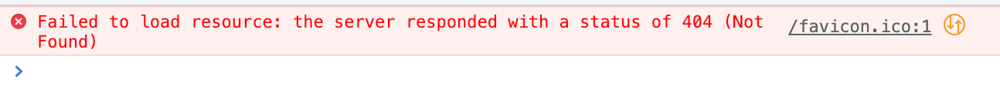

## Testing 

### Validator Testing - Python
No errors were found whne passing through the [CI Python Linter](https://pep8ci.herokuapp.com/#). All files below were passed through the linter: 
- comments app:
    - apps.py
    - models.py
    - serializers.py
    - urls.py
    - views.py 
- games app:
    - apps.py
    - models.py
    - serializers.py
    - urls.py
    - views.py
- likes app:
    - apps.py
    - models.py
    - serializers.py
    - urls.py
    - views.py 
- posts app:
    - apps.py
    - models.py
    - serializers.py
    - urls.py
    - views.py
- profiles app:
    - apps.py
    - models.py
    - serializers.py
    - urls.py
    - views.py 
- reviews app:
    - apps.py
    - models.py
    - serializers.py
    - urls.py
    - views.py 
- goodgames_drf_api app:
    - asgi.py
    - permissions.py
    - serializers.py
    - settings.py
    - urls.py
    - views.py
    - wsgi.py

### Manual Testing

The API was tested manually by ensuring all pages loaded without error on the deployed site:
- [comments](https://goodgames-drf-api.herokuapp.com/comments/)
- [games](https://goodgames-drf-api.herokuapp.com/games/)
- [likes](https://goodgames-drf-api.herokuapp.com/likes/)
- [posts](https://goodgames-drf-api.herokuapp.com/posts/)
- [profiles](https://goodgames-drf-api.herokuapp.com/profiles/)
- [reviews](https://goodgames-drf-api.herokuapp.com/reviews/)

And by going through all CRUD screens and forms on the local application to ensure all the below functionality is present:
- comments:
    - logged in user can create a comment:
        - associated with a post
        - free text content field
    - owner of a comment can edit and delete their own comment:
        - post field cannot be edited
        - free text content field can be edited
        - comment can be deleted
- games:
    - logged in user can create a game:
        - free text title field
        - image field
        - free text description field
    - admin can edit and delete a game:
        - title can be edited
        - image can be changed
        - description can be edited
        - game can be deleted
- likes:
    - logged in user can create a like
        - each like is associated with:
            - game
            - comment
            - post, or
            - review
    - owner of a like can delete their own like
- posts:
    - logged in user can create a post:
        - associated with a game (from dropdown)
        - currently playing checkbox / boolean field
        - completed checkbox / boolean field
        - free text notes field
    - owner of a post can edit and delete their own post:
        - game field can be edited (new game chosen from dropdown)
        - currently playing boolean field can be edited
        - completed boolean field can be edited
        - notes field can be edited
        - post can be deleted
- profiles:
    - profile is automatically created when a new user signs up
    - owner of a profile can edit or delete their own profile:
        - name free text field can be added
        - description free text fiele can be added
        - image can be added
        - profile can be deleted (this functionality is not present on the deployed frontend application)
- reviews: 
    - logged in user can add a review:
        - associated with a post (from dropdown)
        - rating field (must be an integer between 1-5, error will appear if anything else is entered)
        - free text content field
    - owner of a review can edit or delete their review:
        - post field cannot be edited
        - rating field can be edited (with same requirements as creating a review)
        - free text content field can be edited
        - review can be deleted

### Unfixed Bugs

There is one error message in the console:

This is because I have not created a favicon for the deployed version of this site. Because this is a backend API that is only intended to be accessed by my frontend application, and not by users of the site, I will not be adding a favicon.

The 'likes' model also allows for a like to be associated with more than one object (i.e. a game and a post), but the design of the frontend application makes this impossible for the user to implement in practice, as a new like is created every time a user adds a like to a post, comment, review, or game and likes cannot be edited.